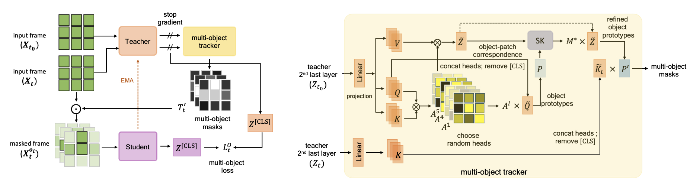
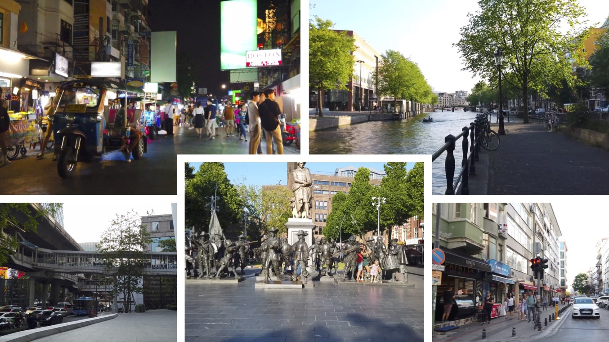

# DoRA_ICLR24
This repo contains the official implementation of ICLR 2024 paper "Is ImageNet worth 1 video? Learning strong image encoders from 1 long unlabelled video" 
=======
This repo contains the official implementation of ICLR 2024 paper "Is ImageNet worth 1 video? Learning strong image encoders from 1 long unlabelled video"  
>>>>>>> 101f1294397d182a79a10b01098bd771271b9fa2

[[`arXiv`](https://arxiv.org/abs/2310.08584)], [[`paper`](https://openreview.net/forum?id=Yen1lGns2o)], [[`dataset`](https://uvaauas.figshare.com/articles/dataset/Dora_WalkingTours_Dataset_ICLR_2024_/25189275)], [[`Project Page`](https://shashankvkt.github.io/dora)]


## Overview
### Motivation
Our goal is to build robust representations by leveraging the rich information in video frames. Standard SSL frameworks such as SimCLR, DINo etc. often assume correspondences between different views. This is true whether using dense or global representations by pooling e.g. iBOT. While it is relatively straightforward to establish correspondences in images, it becomes more challenging when dealing with temporal deformations, requiring some form of object tracking. In videos with a large field of view or ego-motion, obtaining correspondences becomes even more difficult.  


<div align="center">
  
</div>


## High-level idea 

We introduce DoRA, based on multi-object Discovery and tRAcking. It leverages the attention from the [CLS] token of distinct heads in a vision transformer to identify and consistently track multiple objects within a given frame across temporal sequences. On these, a teacher-student distillation loss is then applied. 
Importantly, we do not use any off-the-shelf object tracker or optical flow network. This keeps our pipeline simple and does not require any additional data or training. It also ensures that the learned representation is robust.

## Dataset Preparation

<div align="center">
  
</div>


### Original videos

The complete list of WTour videos are available in [HuggingFace Dataset](https://huggingface.co/datasets/shawshankvkt/Walking_Tours), comprising the YouTube links the detailed instructions on how to download it using necessary scripts.  

In case, the links are broken, you can download the videos directly from [Walking Tour Dataset](https://uvaauas.figshare.com/articles/dataset/Dora_WalkingTours_Dataset_ICLR_2024_/25189275)

### Face-blurred videos  

In order to comply with [GDPR](https://gdpr.eu/what-is-gdpr/), we also try to blur out all faces and license plates appearing in the video using [Deface](https://github.com/ORB-HD/deface)  

To do this for all videos in WTour dataset:
```
python3 -m pip install deface
```
Then run Deface on all videos using the bash script:
```
chmod a+x gdpr_blur_faces.sh  
./gdpr_blur_faces.sh
```

## Training DoRA

### Installing Packages

The requirements are easily installed via Anaconda. Here we create a conda environment called dora and install all the necessary libraries  

```
conda create -n metrix python=3.8.2
conda activate dora
conda install pytorch==1.13.1 torchvision==0.14.1 torchaudio==0.13.1 pytorch-cuda=11.7 -c pytorch -c nvidia
conda install pillow==9.4.0 scipy tensorboardX faiss-gpu==1.6.1 tqdm lmdb scikit-learn pyarrow==2.0.0 DALL-E munkres six einops
```

### Pretraining DoRA

If you are using V100 GPUs with 32GB RAM, we recommend using the following script to pretrain DoRA: 

```
python -m torch.distributed.launch --nproc_per_node=8 main.py --arch vit_small --data_path /path-to-video/venice.mp4 \
  --output_dir /path-to-checkpoint/weights_WTours/DoRA/venice_8frames/ --optimizer adamw \
  --use_bn_in_head False --out_dim 65536 --batch_size_per_gpu 6 --local_crops_number 6 --epochs 100  \
  --num_workers 10 --lr 0.0005 --min_lr 0.00001  --norm_last_layer False  \
  --warmup_teacher_temp_epochs 30 --weight_decay 0.04 --weight_decay_end 0.4 \
  --frame_per_clip 8 --step_between_clips 60
```

For A100 GPUs with 80GB RAM, we recommend using the following pretraining script (only difference is in batch_size_per_gpu):

```
python -m torch.distributed.launch --nproc_per_node=8 main.py --arch vit_small --data_path /path-to-video/venice.mp4 \
  --output_dir /path-to-checkpoint/weights_WTours/DoRA/venice_8frames/ --optimizer adamw \
  --use_bn_in_head False --out_dim 65536 --batch_size_per_gpu 16 --local_crops_number 6 --epochs 100  \
  --num_workers 10 --lr 0.0005 --min_lr 0.00001  --norm_last_layer False  \
  --warmup_teacher_temp_epochs 30 --weight_decay 0.04 --weight_decay_end 0.4 \
  --frame_per_clip 8 --step_between_clips 60
```


## Evaluation

### Linear Probing and KNN

For Linear probing on ImageNet-1K

```
python -m torch.distributed.launch --nproc_per_node=4 eval_linear.py \
--batch_size_per_gpu 1024 --n_last_blocks 4 --avgpool_patchtokens 0 --arch vit_small --lr 0.005 \
--pretrained_weights /path-to-checkpoint/venice/checkpoint.pth --data_path /dataset/imagenet/ \
--output_dir /path-to-output-dir/venice/LP/
```

For KNN evaluation on ImageNet-1K

```
python3 -m torch.distributed.launch --nproc_per_node=4 eval_knn.py \
--arch vit_small --checkpoint_key teacher --data_path /dataset/imagenet/ \
--pretrained_weights /path-to-checkpoint/venice/checkpoint.pth
```

### Semantic Segmentation (ADE20K) and Object Detection (MS-COCO)

Please follow the evaluation scripts from [iBOT](https://github.com/bytedance/ibot)


### Video Object Segmentation (DAVIS) and Object Tracking (GOT-10K)

(todo)

## CITATION

If you find this repository useful, please consider giving a star ⭐ and citation:

```
@inproceedings{venkataramanan2024imagenet,  
  title={Is ImageNet worth 1 video? Learning strong image encoders from 1 long unlabelled video},  
  author={Venkataramanan, Shashanka and Rizve, Mamshad Nayeem and Carreira, Jo{\~a}o and Asano, Yuki M and Avrithis, Yannis},  
  booktitle={International Conference on Learning Representations},  
  year={2024}  
}
<<<<<<< HEAD

```


=======
```
>>>>>>> 101f1294397d182a79a10b01098bd771271b9fa2

#### TODO
- Add checkpoints, logfiles

